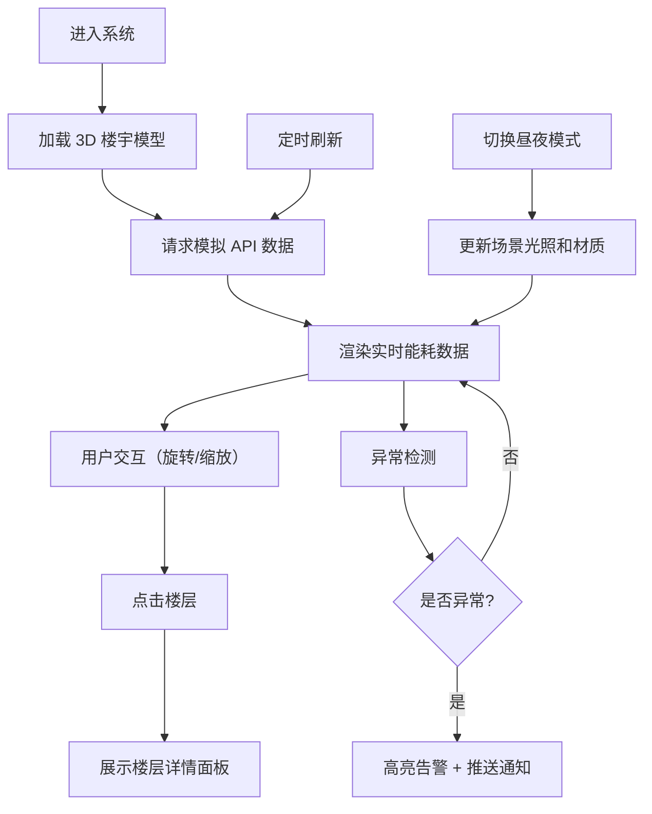

## 1. 产品概述

基于 Three.js 的智能楼宇能耗监控可视化系统，通过 3D 建模直观展示楼宇各楼层各房间的实时能耗数据，支持分项用电趋势分析、异常告警和昼夜模式切换，为楼宇能源管理提供数据驱动的决策支持。

- **主要目的**：实现楼宇能耗的可视化监控与智能分析
- **解决问题**：传统能耗数据展示不直观、异常发现不及时、分项用电分析困难
- **目标用户**：楼宇物业管理人员、能源管理工程师、设施运维团队
- **市场价值**：提升能源管理效率，降低运营成本，助力碳中和目标

## 2. 核心功能

### 2.1 用户角色
| 角色 | 注册方式 | 核心权限 |
|------|----------|----------|
| 管理员 | 系统预置 | 完整的能耗监控、告警配置、数据导出权限 |
| 运维人员 | 管理员创建 | 能耗监控、异常确认、报表查看权限 |
| 访客 | 无需注册 | 仅查看公开的能耗概览数据 |

### 2.2 功能模块
1. **3D 楼宇展示**：可交互楼宇模型、楼层分层展示、房间分户展示、实时能耗数据叠加
2. **能耗数据面板**：分项用电统计（空调/照明/插座）、趋势图表、同比环比分析
3. **异常告警系统**：能耗异常楼层高亮、告警列表、异常详情查看
4. **视图控制**：昼夜模式切换、楼层剖切、视角预设、自动旋转
5. **数据管理**：模拟 API 对接、定时数据刷新、历史数据回放

### 2.3 页面详情
| 页面名称 | 模块名称 | 功能描述 |
|----------|----------|----------|
| 主监控页面 | 3D 楼宇场景 | 展示可交互 3D 楼宇模型，支持缩放、旋转、平移 |
| 主监控页面 | 实时数据面板 | 显示当前总能耗、各分项用电占比、能耗趋势 |
| 主监控页面 | 楼层详情面板 | 点击楼层后显示该层各房间能耗、分项用电趋势图 |
| 主监控页面 | 告警面板 | 展示异常楼层列表、告警级别、处理状态 |
| 主监控页面 | 控制工具栏 | 昼夜模式切换、视角重置、数据刷新、暂停/播放 |

## 3. 核心流程

用户进入系统后，首先看到 3D 楼宇整体视图和全局能耗概览。用户可通过鼠标交互旋转、缩放查看楼宇模型，点击特定楼层查看详细能耗数据。系统自动定时刷新数据，当检测到能耗异常时自动高亮对应楼层并推送告警。用户可切换昼夜模式以获得更好的视觉体验。

## 4. 用户界面设计

### 4.1 设计风格
- **主色调**：科技蓝 (#165DFF) 作为主色，搭配深灰背景营造专业感
- **辅色调**：告警红 (#F53F3F)、正常绿 (#00B42A)、警告黄 (#FF7D00)
- **夜间模式**：深蓝背景 (#0A1628)、霓虹蓝发光效果、半透明玻璃质感
- **日间模式**：浅灰背景 (#F2F3F5)、清晰轮廓线、明亮材质
- **按钮风格**：圆角矩形按钮，悬停时有轻微缩放和发光效果
- **字体**：主要使用 Geologica 作为标题字体，Inter 作为正文字体
- **布局风格**：左侧 3D 场景为主区域，右侧悬浮数据面板，底部控制工具栏
- **图标风格**：使用 lucide-react 线性图标，保持简洁一致

### 4.2 页面设计概述
| 页面名称 | 模块名称 | UI 元素 |
|----------|----------|----------|
| 主监控页面 | 3D 楼宇场景 | 渐变色玻璃幕墙、发光窗户、轮廓高亮、网格地面 |
| 主监控页面 | 实时数据面板 | 玻璃态卡片、渐变进度条、数据发光效果、微动画 |
| 主监控页面 | 楼层详情面板 | 面积图表、环形图、分项能耗卡片、分时趋势图 |
| 主监控页面 | 告警面板 | 告警级别颜色编码、闪烁动画、展开/收起交互 |
| 主监控页面 | 控制工具栏 | 图标按钮、状态切换开关、工具提示 |

### 4.3 响应性
- 桌面端优先设计，适配 1920×1080 及以上分辨率
- 支持响应式布局，数据面板可折叠以适应小屏幕
- 3D 场景自适应容器大小，保持正确比例
- 触摸设备支持双指缩放和单指旋转操作

### 4.4 3D 场景 Guidance
- **环境/HDRI**：日间模式使用明亮的环境光配合天空盒，夜间模式使用深蓝色环境配合霓虹发光效果
- **光照设置**：日间使用半球光 + 方向光模拟自然光，夜间使用点光源模拟室内灯光 + 柔和环境光
- **相机设置**：透视相机，初始视角 45° 俯角，支持 OrbitControls 轨道控制，限制最小最大距离
- **相机运动**：空闲时自动缓慢旋转展示楼宇，用户交互时暂停自动旋转
- **构图与焦点**：楼宇居中放置，周围有简化的地面和环境，焦点始终在楼宇主体
- **交互与动画**：楼层点击有缩放反馈动画，窗户根据能耗亮度变化，异常楼层有脉冲发光动画
- **后期处理**：轻微 bloom 效果增强发光感，夜间模式增加胶片颗粒提升质感
- **性能优化**：使用 InstancedMesh 优化窗户渲染，LOD 控制细节，目标帧率 60fps
