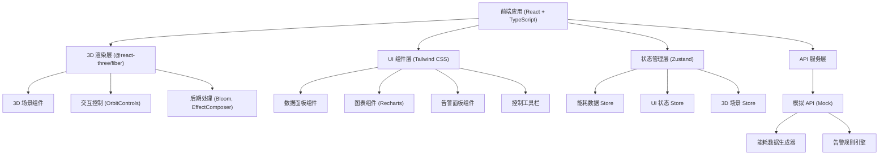

## 1. 架构设计



## 2. 技术描述

- **前端框架**：React@18 + TypeScript@5 + Vite@5
- **3D 渲染引擎**：three@0.160 + @react-three/fiber@8 + @react-three/drei@9 + @react-three/postprocessing@2
- **状态管理**：zustand@4
- **样式方案**：tailwindcss@3
- **图表库**：recharts@2
- **图标库**：lucide-react@0.294
- **初始化工具**：vite-init
- **后端**：无需后端，使用 Mock 模拟 API
- **数据**：前端模拟数据生成器，支持定时刷新

## 3. 目录结构

```
label-041/
├── src/
│   ├── components/
│   │   ├── three/
│   │   │   ├── Building.tsx          # 楼宇主体
│   │   │   ├── Floor.tsx             # 楼层组件
│   │   │   ├── Room.tsx              # 房间组件
│   │   │   ├── Windows.tsx           # 窗户组件 (InstancedMesh)
│   │   │   ├── Ground.tsx            # 地面和环境
│   │   │   └── Scene.tsx             # 场景容器
│   │   ├── ui/
│   │   │   ├── EnergyPanel.tsx       # 能耗数据面板
│   │   │   ├── FloorDetailPanel.tsx  # 楼层详情面板
│   │   │   ├── AlarmPanel.tsx        # 告警面板
│   │   │   ├── ControlBar.tsx        # 控制工具栏
│   │   │   ├── TrendChart.tsx        # 趋势图表
│   │   │   ├── PieChart.tsx          # 分项占比图
│   │   │   └── StatCard.tsx          # 统计卡片
│   │   └── App.tsx
│   ├── store/
│   │   ├── useEnergyStore.ts         # 能耗数据状态
│   │   ├── useSceneStore.ts          # 3D 场景状态
│   │   └── useUIStore.ts             # UI 状态
│   ├── hooks/
│   │   ├── useEnergyData.ts          # 能耗数据获取 Hook
│   │   ├── useAnimation.ts           # 动画控制 Hook
│   │   └── useAlarm.ts               # 告警检测 Hook
│   ├── api/
│   │   └── mockApi.ts                # 模拟 API
│   ├── utils/
│   │   ├── energyCalculator.ts       # 能耗计算工具
│   │   ├── colorUtils.ts             # 颜色工具
│   │   └── constants.ts              # 常量定义
│   ├── types/
│   │   └── index.ts                  # 类型定义
│   ├── main.tsx
│   └── index.css
├── .trae/documents/
│   ├── prd.md
│   └── tech-architecture.md
├── package.json
├── tsconfig.json
├── vite.config.ts
└── tailwind.config.js
```

## 4. 核心数据结构

### 4.1 类型定义

```typescript
// 能耗分项类型
export type EnergyCategory = 'airConditioning' | 'lighting' | 'socket'

// 能耗数据
export interface EnergyData {
  timestamp: number
  total: number
  airConditioning: number
  lighting: number
  socket: number
}

// 房间数据
export interface RoomData {
  id: string
  name: string
  floor: number
  area: number
  energy: EnergyData
  isNormal: boolean
}

// 楼层数据
export interface FloorData {
  id: string
  name: string
  level: number
  rooms: RoomData[]
  energy: EnergyData
  isNormal: boolean
  alarmLevel?: 'low' | 'medium' | 'high'
}

// 楼宇数据
export interface BuildingData {
  id: string
  name: string
  floors: FloorData[]
  totalEnergy: EnergyData
  lastUpdate: number
}

// 告警数据
export interface AlarmData {
  id: string
  floorId: string
  floorName: string
  level: 'low' | 'medium' | 'high'
  category: EnergyCategory
  message: string
  timestamp: number
  acknowledged: boolean
}

// 场景状态
export interface SceneState {
  isNightMode: boolean
  autoRotate: boolean
  selectedFloorId: string | null
  hoveredFloorId: string | null
  cameraPosition: [number, number, number]
}
```

### 4.2 模拟 API 接口

```typescript
// 获取楼宇整体数据
GET /api/building
Response: BuildingData

// 获取指定楼层详情
GET /api/floor/:floorId
Response: FloorData

// 获取能耗趋势数据
GET /api/energy/trend?floorId=:floorId&period=:period
Response: EnergyData[]

// 获取告警列表
GET /api/alarms
Response: AlarmData[]

// 确认告警
POST /api/alarms/:alarmId/acknowledge
Response: { success: boolean }
```

## 5. 核心组件设计

### 5.1 3D 场景组件

- **Scene.tsx**: 场景容器，管理光照、相机、后期处理效果
- **Building.tsx**: 楼宇主体，包含多个 Floor 子组件
- **Floor.tsx**: 楼层组件，可点击选中，显示能耗状态，异常时高亮
- **Room.tsx**: 房间组件，根据能耗数据显示不同颜色和亮度
- **Windows.tsx**: 使用 InstancedMesh 优化大量窗户渲染
- **Ground.tsx**: 地面、网格线、环境装饰

### 5.2 UI 组件

- **EnergyPanel.tsx**: 右侧悬浮面板，显示整体能耗统计
- **FloorDetailPanel.tsx**: 点击楼层后显示的详细信息面板
- **AlarmPanel.tsx**: 告警列表，支持展开/收起、确认操作
- **ControlBar.tsx**: 底部控制栏，昼夜模式切换、视角控制等
- **TrendChart.tsx**: 能耗趋势面积图
- **PieChart.tsx**: 分项能耗占比环形图

### 5.3 状态管理

- **useEnergyStore**: 存储楼宇、楼层、房间能耗数据，告警数据
- **useSceneStore**: 存储 3D 场景状态（昼夜模式、选中楼层、相机位置等）
- **useUIStore**: 存储 UI 状态（面板展开/收起、加载状态等）

### 5.4 核心 Hooks

- **useEnergyData**: 封装数据获取逻辑，支持定时刷新
- **useAnimation**: 管理动画状态，如脉冲、渐变、过渡效果
- **useAlarm**: 异常检测逻辑，根据阈值判断能耗是否异常

## 6. 关键技术实现

### 6.1 昼夜模式切换
- 通过 Zustand 管理 isNightMode 状态
- 切换时更新场景光照、背景色、材质颜色
- 使用 useFrame 实现平滑过渡动画

### 6.2 能耗异常高亮
- 实时对比能耗数据与预设阈值
- 异常楼层使用 emissive 材质 + Bloom 后期处理实现发光效果
- 添加脉冲动画增强告警视觉效果

### 6.3 数据动态刷新
- 使用 setInterval 定时调用模拟 API
- 支持手动刷新和暂停功能
- 数据更新时使用过渡动画避免突兀变化

### 6.4 性能优化
- 使用 InstancedMesh 优化重复几何体（窗户）
- 合理设置相机 far/near 裁剪面
- 使用 LOD (Level of Detail) 控制远处细节
- 限制最大帧率，避免过度消耗资源
